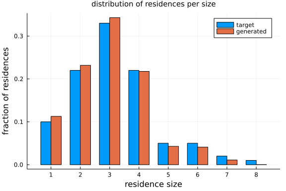
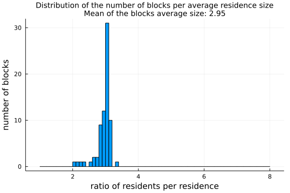
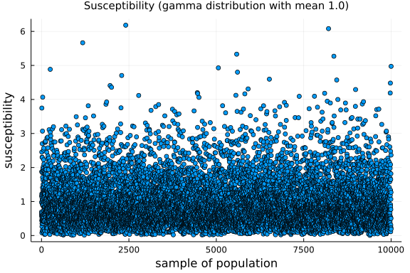
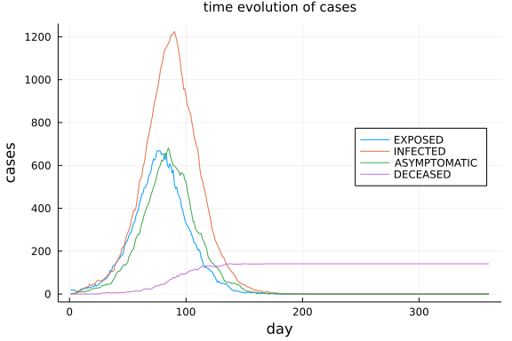

# Epidemic simulation via a discrete-time, agent-based stochastic model with a random scenario


## Introduction

We construct, here, the scenario for an epidemics, in which the population is composed
of a number of agents (or individuals), aggregated into residences, and interacting with
each other within the residences and through the following structures:
1. clusters of school and workplaces,
2. networks of social and commerce connections; and
3. causual encounters with the general population.

In the current example, we build a random scenario, in a rectangular region.


## Loading packages

```julia
using Random

using SparseArrays

using StatsBase
using Distributions

using Plots
using StatsPlots: groupedbar

using EpiSiming

#=
using Graphs
using Graphs
using GraphPlot
=#
```


## Building the Scenario


### Set global parameters


#### Population number

```julia
num_population = 10_000
```

```
10000
```


#### Region size

```julia
region_size = (6, 12)
```

```
(6, 12)
```


#### Distribution of residences per size

```julia
res_size_distribution = [10, 22, 33, 22, 5, 5, 2, 1] |> v -> Weights(v / sum(v))
```

```
8-element StatsBase.Weights{Float64, Float64, Vector{Float64}}:
 0.1
 0.22
 0.33
 0.22
 0.05
 0.05
 0.02
 0.01
```


#### Susceptibility and infectivity parameters


Parameters of the Gamma distribution for the susceptibility and infectivity factors

```julia
Γ = (
    sus_shape = 2.0,
    sus_scale = 0.5,
    inf_shape = 4.0,
    inf_scale= 0.25
)
```

```
(sus_shape = 2.0, sus_scale = 0.5, inf_shape = 4.0, inf_scale = 0.25)
```


#### Age pyramid

```julia
pop_pyramid = let age_max = 100, p = 2, pyramid_func(a, age_max, p) = ( a + 1 ) * (age_max - a)^p
    Weights(
        pyramid_func.(0:age_max, age_max, p) / sum(pyramid_func.(0:age_max, age_max, p))
    )
end
```

```
101-element StatsBase.Weights{Float64, Float64, Vector{Float64}}:
 0.0011532894698904953
 0.0022606780188793485
 0.0033228576206484946
 0.004340520248879868
 0.005314357877255402
 0.006245062479457031
 0.0071333260291666905
 0.007979840500066315
 0.008785297865837836
 0.00955039010016319
 ⋮
 0.0006864378924788228
 0.000531205129831562
 0.00039442499870254936
 0.0002767894727737188
 0.00017899052572700484
 0.00010172013124434167
 4.567026300766361e-5
 1.1532894698904952e-5
 0.0
```


#### Contact rates

```julia
τ = Dict{Symbol, Float64}(
    :residences => 0.3,
    :work_places => 0.1,
    :school_places => 0.2
)
```

```
Dict{Symbol, Float64} with 3 entries:
  :work_places   => 0.1
  :school_places => 0.2
  :residences    => 0.3
```


#### Recovery rates

```julia
γ = (
    rate_expos = 0.25, # rate out of exposed
    rate_infec = 0.1, # rate out of infected
    rate_asymp = 0.2 # rate out of asymptomatic
)
```

```
(rate_expos = 0.25, rate_infec = 0.1, rate_asymp = 0.2)
```


#### Fate probabilities

```julia
prob = (
    asymp = 0.6, # probability of becoming asymptomatic (vs. symptomatic = infected)
    decease = 0.02 # probability of deceasing
)
```

```
(asymp = 0.6, decease = 0.02)
```


#### Random number generator

Set random number generator for repeatability in testings

```julia
rng = MersenneTwister(123)
```

```
MersenneTwister(123)
```


### Generating scenario


#### Generating a random matrix of blocks with the population divided per block

```julia
pop_blocks = EpiSiming.gen_random_pop_blocks(rng, num_population, region_size)
```

```
6×12 Matrix{Int64}:
 265  118  124   93  209   71  256  182  230   16  150   25
  99  250   29  252  252  154  113  118  182  108  267  196
  75   78  163  233   14  207   71  234  208  186  158  211
 134  151   26   40   27  164    4   86   73   73  179  225
 175   10   81   75  197  184   71  242   35   60  108  150
 140  152  252  114  235   98   20  252   88   55  275  152
```


Heatmap

```julia
display(
    heatmap(
        pop_blocks,
        c = cgrad([:white, :orange, :red]),
        annotate = [
            (j, i, text(pop_blocks[i, j], 8, :black, :center))
            for i in 1:size(pop_blocks, 1) for j in 1:size(pop_blocks, 2)
        ],
        xlabel = "km",
        ylabel = "km",
        title = "Distribution per block of the $num_population area residents",
        titlefont = 10
    )
)
```


#### Generating residences per block

```julia
res_blocks_distrib = EpiSiming.gen_res_blocks(rng, pop_blocks, res_size_distribution)
```

```
6×12 Matrix{Vector{Int64}}:
 [9, 21, 27, 19, 4, 5, 1, 0]  …  [0, 2, 3, 3, 0, 0, 0, 0]
 [4, 7, 14, 7, 1, 1, 0, 0]       [8, 15, 20, 13, 3, 4, 1, 0]
 [3, 6, 8, 5, 2, 1, 0, 0]        [9, 15, 21, 16, 4, 3, 1, 0]
 [5, 10, 15, 9, 2, 3, 0, 0]      [7, 15, 24, 16, 4, 3, 2, 0]
 [6, 14, 20, 13, 2, 2, 1, 0]     [7, 10, 16, 12, 3, 2, 0, 0]
 [5, 10, 19, 9, 2, 2, 0, 0]   …  [6, 11, 16, 11, 4, 2, 0, 0]
```


Visualizations

```julia
display(
    groupedbar(
        [res_size_distribution sum(res_blocks_distrib) /
            sum(Iterators.flatten(res_blocks_distrib))],
        xticks = eachindex(res_size_distribution),
        bar_position = :dodge,
        bar_width = 0.7,
        label = ["target" "generated"],
        xlabel = "residence size",
        ylabel = "fraction of residences",
        title = "distribution of residences per size",
        titlefont = 10
    )
)

display(
    histogram(
        reshape(pop_blocks ./ map(sum, res_blocks_distrib), :, 1),
        bins = firstindex(res_size_distribution):0.1:lastindex(res_size_distribution),
        label = nothing,
        xlabel = "ratio of residents per residence",
        ylabel = "number of blocks",
        title = "Distribution of the number of blocks per average residence size" *
            "\nMean of the blocks average size: " * 
            "$(round(mean(pop_blocks ./ map(sum, res_blocks_distrib)), digits = 2))",
        titlefont = 10
    )
)
```





#### Generating the list of residences with all the required information

```julia
residences = EpiSiming.gen_residences(rng, res_blocks_distrib)
```

```
3299-element EpiSiming.Residences{Int64, Float64}:
 (1, (1.5555555555555556, 1.3888888888888888), 1, [1])
 (1, (1.5, 1.0), 1, [2])
 (1, (1.5, 1.5), 1, [3])
 (1, (1.7222222222222223, 1.2222222222222223), 1, [4])
 (1, (1.9444444444444444, 1.5), 1, [5])
 (1, (1.3333333333333333, 1.7777777777777777), 1, [6])
 (1, (1.5555555555555556, 1.0555555555555556), 1, [7])
 (1, (1.5555555555555556, 1.2777777777777777), 1, [8])
 (1, (1.6111111111111112, 1.6111111111111112), 1, [9])
 (1, (1.7222222222222223, 1.7222222222222223), 2, [10, 11])
 ⋮
 (72, (6.285714285714286, 12.357142857142858), 4, [9957, 9958, 9959, 9960])
 (72, (6.928571428571429, 12.214285714285714), 4, [9961, 9962, 9963, 9964])
 (72, (6.642857142857143, 12.428571428571429), 4, [9965, 9966, 9967, 9968])
 (72, (6.714285714285714, 12.642857142857142), 5, [9969, 9970, 9971, 9972, 
9973])
 (72, (6.357142857142857, 12.928571428571429), 5, [9974, 9975, 9976, 9977, 
9978])
 (72, (6.142857142857143, 12.142857142857142), 5, [9979, 9980, 9981, 9982, 
9983])
 (72, (6.5, 12.857142857142858), 5, [9984, 9985, 9986, 9987, 9988])
 (72, (6.785714285714286, 12.142857142857142), 6, [9989, 9990, 9991, 9992, 
9993, 9994])
 (72, (6.928571428571429, 12.0), 6, [9995, 9996, 9997, 9998, 9999, 10000])
```


Visualizations

```julia
display(
    scatter(
        residences.position,
        markersize = 2,
        markerstrokecolor = :auto,
        label = false,
        xlabel = "km",
        ylabel = "km",
        title = "Residences",
        titlefont = 10
    )
)

display(
    scatter(
        filter( p -> (2.0 ≤ first(p) ≤ 3.0) && (2.0 ≤ last(p) ≤ 3.0), residences.position),
        markersize = 2,
        markerstrokecolor = :auto,
        label = false,
        xlabel = "km",
        ylabel = "km",
        title = "Residences",
        titlefont = 10
    )
)

display(
    scatter(
        filter( p -> (2.0 ≤ first(p) ≤ 2.2) && (2.0 ≤ last(p) ≤ 2.2), residences.position),
        markersize = 2,
        markerstrokecolor = :auto,
        label = false,
        xlabel = "km",
        ylabel = "km",
        title = "Residences",
        titlefont = 10
    )
)
```


#### Generating population

```julia
population = EpiSiming.gen_population(
    rng,
    residences,
    res_blocks_distrib,
    Γ,
    pop_pyramid
)
```

```
10000-element EpiSiming.Population{Int64, EpiSiming.Phase}:
 (S, 1, 1, (1.5694444444444444, 1.3888888888888888), 27, 0.9764886243219769
, 0.6357211366516126, Dict{Symbol, Int64}(), Dict{Symbol, Int64}())
 (S, 1, 2, (1.5138888888888888, 1.0), 41, 0.6942945570226071, 1.21787006891
35529, Dict{Symbol, Int64}(), Dict{Symbol, Int64}())
 (S, 1, 3, (1.5138888888888888, 1.5), 55, 0.6218396682687442, 1.63796045706
6602, Dict{Symbol, Int64}(), Dict{Symbol, Int64}())
 (S, 1, 4, (1.7361111111111112, 1.2222222222222223), 18, 1.1608345691082784
, 0.8266416855792061, Dict{Symbol, Int64}(), Dict{Symbol, Int64}())
 (S, 1, 5, (1.9583333333333333, 1.5), 40, 0.5665807230571024, 1.56943596658
52415, Dict{Symbol, Int64}(), Dict{Symbol, Int64}())
 (S, 1, 6, (1.347222222222222, 1.7777777777777777), 84, 1.8774433398188708,
 0.6297468611675472, Dict{Symbol, Int64}(), Dict{Symbol, Int64}())
 (S, 1, 7, (1.5694444444444444, 1.0555555555555556), 61, 0.4402465743567043
, 1.5852986040270807, Dict{Symbol, Int64}(), Dict{Symbol, Int64}())
 (S, 1, 8, (1.5694444444444444, 1.2777777777777777), 15, 2.4539238727547366
, 0.8891566113330923, Dict{Symbol, Int64}(), Dict{Symbol, Int64}())
 (S, 1, 9, (1.625, 1.6111111111111112), 64, 1.2257535932601769, 0.733665500
4730221, Dict{Symbol, Int64}(), Dict{Symbol, Int64}())
 (S, 1, 10, (1.7361111111111112, 1.7222222222222223), 17, 3.746785698349046
6, 1.4627532054501085, Dict{Symbol, Int64}(), Dict{Symbol, Int64}())
 ⋮
 (S, 1, 3298, (6.767857142857142, 12.142857142857142), 1, 0.767530747635236
4, 1.0377563037458868, Dict{Symbol, Int64}(), Dict{Symbol, Int64}())
 (S, 1, 3298, (6.776785714285714, 12.12739240350385), 40, 1.068280357162537
9, 0.6618513013936488, Dict{Symbol, Int64}(), Dict{Symbol, Int64}())
 (S, 1, 3298, (6.794642857142857, 12.12739240350385), 23, 1.818376815241877
8, 0.7098381279252082, Dict{Symbol, Int64}(), Dict{Symbol, Int64}())
 (S, 1, 3299, (6.946428571428572, 12.0), 59, 0.22760975111790843, 1.5348052
588350196, Dict{Symbol, Int64}(), Dict{Symbol, Int64}())
 (S, 1, 3299, (6.9375, 12.015464739353293), 63, 0.5026865185118925, 0.81827
3296631051, Dict{Symbol, Int64}(), Dict{Symbol, Int64}())
 (S, 1, 3299, (6.919642857142858, 12.015464739353293), 14, 1.27017350726709
4, 1.1990419130110863, Dict{Symbol, Int64}(), Dict{Symbol, Int64}())
 (S, 1, 3299, (6.910714285714286, 12.0), 23, 2.3657635726273125, 0.98585785
6950502, Dict{Symbol, Int64}(), Dict{Symbol, Int64}())
 (S, 1, 3299, (6.919642857142858, 11.984535260646707), 49, 0.19019114296379
07, 0.9279339900554412, Dict{Symbol, Int64}(), Dict{Symbol, Int64}())
 (S, 1, 3299, (6.9375, 11.984535260646707), 14, 4.972968599859624, 0.462722
0879303531, Dict{Symbol, Int64}(), Dict{Symbol, Int64}())
```


#### Susceptibility distribution

```julia
display(
    scatter(
        population.susceptibility,
        title = "Susceptibility (gamma distribution with mean $(Γ.sus_shape * Γ.sus_scale))",
        titlefont = 10,
        label = nothing,
        xlabel = "sample of population",
        ylabel = "susceptibility"
    )
)

let bins = 100, interval = extrema(population.susceptibility) |>  u -> u[2] - u[1]
    plt = histogram(
        population.susceptibility,
        bins = bins,
        label = "generated",
        title = "susceptibility histogram",
        titlefont = 10,
        xlabel = "susceptibility",
        ylabel = "population"
    )
    plot!(
        plt,
        x -> (num_population * interval / bins + 1) *
            Distributions.pdf(Distributions.Gamma(Γ.sus_shape, Γ.sus_scale), x),
            label = "target (Gamma distribution)"
    )
    display(plt)
end
```




#### Infectivity

```julia
display(
    scatter(
        population.infectivity,
        title = "Infectivity (gamma distribution with mean $(Γ.inf_shape * Γ.inf_scale))",
        titlefont = 10,
        label = nothing,
        xlabel = "sample of population",
        ylabel = "infectivity"
    )
)

let bins = 100, interval = extrema(population.infectivity) |>  u -> u[2] - u[1]
    plt = histogram(
        population.infectivity,
        bins = bins,
        label = "generated",
        title = "infectivity histogram",
        titlefont = 10,
        xlabel = "infectivity",
        ylabel = "population"
    )

    plot!(
        plt,
        x -> (num_population * interval / bins + 1) *
            Distributions.pdf(Distributions.Gamma(Γ.inf_shape, Γ.inf_scale), x),
        label = "target (Gamma distribution)"
    )
    display(plt)
end
```


#### Age distribution

```julia
plt = histogram(
    population.age,
    bins = length(pop_pyramid) + 1,
    label = "generated",
    title = "Age pyramid",
    titlefont = 10,
    xlabel = "age",
    ylabel = "individuals"
)

plot!(plt, 0:length(pop_pyramid) - 1, num_population * pop_pyramid, label = "target")
display(plt)
```


#### Agents location

```julia
display(
    scatter(
        population.position,
        c = map(s -> EpiSiming.phase_colors[s], population.phase),
        markersize = 1,
        markerstrokecolor = :auto,
        label = false,
        xlabel = "km",
        ylabel = "km",
        title = "Population",
        titlefont = 10
    )
)

display(
    scatter(
        filter(p -> (3.0 < first(p) < 4.0) & (1.0 < last(p) < 2.0), population.position),
        c = map(
            n -> EpiSiming.phase_colors[population.phase[n]],
            filter(
                n -> (3.0 < first(population.position[n]) < 4.0) &
                    (1.0 < last(population.position[n]) < 2.0),
                    eachindex(population.position)
            )
        ),
        markersize = 4,
        markerstrokecolor = :auto,
        xlabel = "km",
        ylabel = "km",
        label = false,
        title = "Population",
        titlefont = 10
    )
)

display(
    scatter(
        filter(p -> (3.2 < first(p) < 3.8) & (1.2 < last(p) < 1.8), population.position),
        c = map(
            n -> EpiSiming.phase_colors[population.phase[n]],
            filter(
                n -> (3.2 < first(population.position[n]) < 3.8) &
                    (1.2 < last(population.position[n]) < 1.8),
                    eachindex(population.position)
            )
        ),
        markersize = 4,
        markerstrokecolor = :auto,
        xlabel = "km",
        ylabel = "km",
        label = false,
        title = "Population",
        titlefont = 10
    )
)

display(
    scatter!(
        filter( p -> (3.2 ≤ first(p) ≤ 3.8) && (1.2 ≤ last(p) ≤ 1.8), residences.position),
        markersize = 4,
        markerstrokecolor = :auto,
        color = :green,
        label = false,
        xlabel = "km",
        ylabel = "km",
        title = "Residences",
        titlefont = 10
    )
)
```


### Generate clusters

```julia
max_size = 100
α = 1.8

clusters = Dict{Symbol, Vector{Vector{Int}}}()

push!(
    clusters,
    :work_places => EpiSiming.gen_clusters(
        rng,
        filter(n -> population.age[n] ≥ 18, 1:num_population),
        max_size,
        α
    )
)

push!(
    clusters,
    :school_places => EpiSiming.gen_clusters(
        rng,
        filter(n -> population.age[n] < 20, 1:num_population),
        max_size,
        α
    )
)

for (k, v) in clusters
    for (i, r) in enumerate(v)
        for n in r
            push!(population.clusters[n], k => i)
        end
    end
end
```


Visualizations

```julia
plt = histogram(
    length.(clusters[:work_places]),
    bins = max_size,
    xlabel = "work size",
    ylabel = "number of work places",
    label = "generated",
    title = "Distribution of work places according to size",
    titlefont = 10
)
plot!(
    plt,
    length(clusters[:work_places]) * EpiSiming.decay.(1:max_size, α) / sum(EpiSiming.decay.(1:max_size, α)),
    linewidth = 2,
    label = "target"
)
display(plt)
```


## Evolution of the epidemics


### Initial infection

```julia
num_exposed_at_time_0 = div(num_population, 500) # (= 0.2%) 20

exposed_at_time_0 = sample(rng, 1:num_population, num_exposed_at_time_0, replace = false)

population.phase[exposed_at_time_0] .= EXPOSED
```

```
20-element view(::Vector{EpiSiming.Phase}, [3568, 9472, 9583, 1145, 3449, 4
763, 8785, 5427, 9500, 8014, 3970, 7360, 2089, 9943, 3472, 799, 6673, 2556,
 6251, 4044]) with eltype EpiSiming.Phase:
 E
 E
 E
 E
 E
 E
 E
 E
 E
 E
 E
 E
 E
 E
 E
 E
 E
 E
 E
 E
```


### Evolution parameters

```julia
num_steps = 360
time_step = 1
```

```
1
```


### Time evolution

```julia
@time evolution = EpiSiming.evolve!(
    rng,
    population,
    residences,
    clusters,
    τ,
    γ,
    prob,
    num_steps,
    time_step,
    verbose_step = 10
)

@time summary = EpiSiming.get_summary(evolution)
```

```
1.267917 seconds (26.84 k allocations: 22.320 MiB)
  0.274720 seconds (2 allocations: 19.766 KiB)
360×7 Matrix{Int64}:
 9980  20   0   0     0  0  0
 9980  15   2   3     0  0  0
 9977  12   3   8     0  0  0
 9972  14   4   8     2  0  0
 9970  13   6   7     4  0  0
 9964  15   7   8     6  0  0
 9960  15   7  10     8  0  0
 9958  12   8  10    12  0  0
 9951  15   9   7    18  0  0
 9948  12  11   9    20  0  0
    ⋮                    ⋮  
 5701   0   0   0  4299  0  0
 5701   0   0   0  4299  0  0
 5701   0   0   0  4299  0  0
 5701   0   0   0  4299  0  0
 5701   0   0   0  4299  0  0
 5701   0   0   0  4299  0  0
 5701   0   0   0  4299  0  0
 5701   0   0   0  4299  0  0
 5701   0   0   0  4299  0  0
```


Visualizations

```julia
display(
    plot(
        summary[:, 2:end],
        labels = string.(reduce(hcat, EpiSiming.phaselist[2:end])),
        legend = :left,
        xlabel = "day",
        ylabel = "cases",
        title = "time evolution of cases",
        titlefont = 10
    )
)

display(
    plot(
        summary[:, [2, 3, 4, 6]],
        labels = string.(reduce(hcat, EpiSiming.phaselist[[2, 3, 4, 6]])),
        legend = :right,
        xlabel = "day",
        ylabel = "cases",
        title = "time evolution of cases",
        titlefont = 10
    )
)
```



